# Architecture & Setup Flow

Two repos and three external services work together to produce a same-image-promotion CI/CD pipeline. This document shows what you build and how the pieces connect.

---

## One-time setup flow

Run through these steps once per domain. Steps ①–③ and ⑤–⑦ are CLI commands; only step ④ (creating the Doppler project) requires a browser.

```mermaid
%%{init: {"flowchart": {"htmlLabels": true}}}%%
flowchart TD
    A["<div style='text-align:left; padding:2px 8px'><b>① Install skill</b><br/>• Fork <code>anatesan-stream/claude-skills-deploy</code> on GitHub<br/>• Clone your fork to <code>~/.claude/skills/setup-coolify/</code></div>"]
    B["<div style='text-align:left; padding:2px 8px'><b>② Configure machine credentials</b><br/>File: <code>~/.claude/coolify.json</code><br/>• Coolify URL<br/>• API key<br/>• ssh_host (alias in ~/.ssh/config)<br/>• Doppler account</div>"]
    C["<div style='text-align:left; padding:2px 8px'><b>③ Bootstrap your app repo</b><br/><code>bash ~/.claude/skills/setup-coolify/init/init.sh</code><br/>Writes two files:<br/>• <code>coolify.yaml</code> — deploy manifest, safe to commit<br/>• <code>.github/workflows/deploy.yml</code> — CI pipeline</div>"]
    D["<div style='text-align:left; padding:2px 8px'><b>④ Create Doppler project</b> ⚠ browser step<br/>• New project at dashboard.doppler.com<br/>• Create two configs: staging · production<br/>• Add all secrets listed in <code>coolify.yaml</code> env_vars</div>"]
    E["<div style='text-align:left; padding:2px 8px'><b>⑤ Dry-run validate</b><br/><code>/setup-coolify validate</code><br/>• Checks Coolify API reachability<br/>• Verifies every Doppler secret exists in staging + production<br/>• No mutations</div>"]
    F["<div style='text-align:left; padding:2px 8px'><b>⑥ Provision</b><br/><code>/setup-coolify</code><br/>• Coolify staging app created<br/>• Coolify production app created<br/>• Doppler service tokens generated + wired as DOPPLER_TOKEN<br/>• Docker volume created on VPS for Doppler fallback cache<br/>• App UUIDs written back to <code>coolify.yaml</code></div>"]
    G["<div style='text-align:left; padding:2px 8px'><b>⑦ Go live</b><br/>• <code>git add coolify.yaml .github/workflows/deploy.yml</code><br/>• <code>git commit -m 'ci: add Coolify deploy pipeline'</code><br/>• <code>git push</code><br/>GitHub Actions pipeline is now active</div>"]

    A --> B --> C --> D --> E --> F --> G

    style A fill:#e3f2fd,stroke:#1976D2,color:#000
    style B fill:#e3f2fd,stroke:#1976D2,color:#000
    style C fill:#e3f2fd,stroke:#1976D2,color:#000
    style D fill:#fff3e0,stroke:#F57C00,color:#000
    style E fill:#e3f2fd,stroke:#1976D2,color:#000
    style F fill:#e3f2fd,stroke:#1976D2,color:#000
    style G fill:#e8f5e9,stroke:#388E3C,color:#000
```



---

## End-state component architecture

After setup, this is what exists and how it connects. Everything flows left-to-right: the skill repo installs onto your machine, your machine generates the per-repo config files, and a `git push` drives the runtime deploy loop.

```mermaid
graph LR
    subgraph SKILL_REPO ["📦 GitHub: claude-skills-deploy  (this repo)"]
        SR["SKILL.md\nscripts/  init/  docs/  references/"]
    end

    subgraph DEV ["💻 Developer Machine"]
        SKILL["~/.claude/skills/setup-coolify/\ninstalled skill"]
        CJSON["~/.claude/coolify.json\nCoolify URL · API key\nDoppler account · ssh_host"]
    end

    subgraph APP_REPO ["📁 GitHub: your-org/your-app"]
        YAML["coolify.yaml\ndeploy manifest — committed, no secrets"]
        WF[".github/workflows/deploy.yml\nCI pipeline — committed"]
    end

    subgraph CI ["⚙ GitHub Actions"]
        BUILD["build Docker image\ntag: git short SHA"]
        PUSH_IMG["push to GHCR"]
        DEPLOY_STG["PATCH staging → new tag\ntrigger Coolify deploy"]
        SMOKE["smoke test\nHTTP GET /health"]
        DEPLOY_PRD["PATCH production → same tag\ntrigger Coolify deploy\n(no rebuild)"]
    end

    subgraph REGISTRY ["🐳 GHCR\nghcr.io/your-org/your-app"]
        IMGS["your-app:abc1234\nyour-app:def5678 …"]
    end

    subgraph COOLIFY ["🚀 Coolify  (your VPS)"]
        STG["Staging app\nyour-app-staging.example.com"]
        PRD["Production app\nyour-app.example.com"]
    end

    subgraph DOPPLER ["🔐 Doppler"]
        DS["staging config\nservice token A"]
        DP_["production config\nservice token B"]
    end

    SR        -->|"git clone"| SKILL
    SKILL     -->|"init.sh generates"| YAML
    SKILL     -->|"init.sh generates"| WF
    CJSON     -->|"/setup-coolify\nprovisions apps\n+ wires tokens"| COOLIFY
    CJSON     -->|"/setup-coolify\ncreates service tokens"| DOPPLER

    YAML      -->|"read by workflow"| CI
    WF        -->|"triggers on\ngit push → main"| BUILD
    BUILD     --> PUSH_IMG
    BUILD     --> DEPLOY_STG
    PUSH_IMG  --> IMGS
    DEPLOY_STG --> SMOKE
    SMOKE     --> DEPLOY_PRD
    DEPLOY_STG -->|"deploy API"| STG
    DEPLOY_PRD -->|"deploy API"| PRD
    STG       -->|"pulls image"| IMGS
    PRD       -->|"pulls image"| IMGS
    DS        -->|"DOPPLER_TOKEN\nDoppler CLI injects\nsecrets at container start"| STG
    DP_       -->|"DOPPLER_TOKEN\nDoppler CLI injects\nsecrets at container start"| PRD
```



---

## What lives where after setup

| Location | What's there | Committed? |
|----------|-------------|-----------|
| `~/.claude/skills/setup-coolify/` | Skill files (SKILL.md, scripts, init, docs) | No — local install |
| `~/.claude/coolify.json` | Coolify URL + API key + Doppler account + `ssh_host` | **Never** — contains secrets |
| `your-app/coolify.yaml` | Deploy manifest: project slug, server alias, domains, env var names | **Yes** — no secrets |
| `your-app/.github/workflows/deploy.yml` | GitHub Actions pipeline (build → GHCR → Coolify) | **Yes** |
| GHCR | Docker images tagged by git SHA; N most recent kept | N/A |
| Coolify (VPS) | Staging app + production app with `DOPPLER_TOKEN` env var set | N/A |
| Doppler | Project with `staging` + `production` configs; service tokens per env | N/A |

---

## How same-image promotion works

The pipeline builds the Docker image **once** (tagged with the git SHA) and deploys the exact same tag to both environments. Secrets are never baked into the image — they are injected at container start by the Doppler CLI installed in the Dockerfile.

```
git push
  └─► build image → tag :abc1234 → push GHCR
        └─► deploy staging (tag :abc1234) → smoke test
              └─► deploy production (same tag :abc1234, no rebuild)
```

This means staging and production always run the same binary. Promotion is a config change (which tag Coolify points at), not a new build.

---

## See also

- [Setup guide](./setup-guide.md) — step-by-step walkthrough with concrete commands
- [Schema reference](./schema.md) — all `coolify.yaml` and `coolify.json` fields documented
- [Fork guide](./fork-guide.md) — using this skill for a second domain (e.g. strategem.ai)
